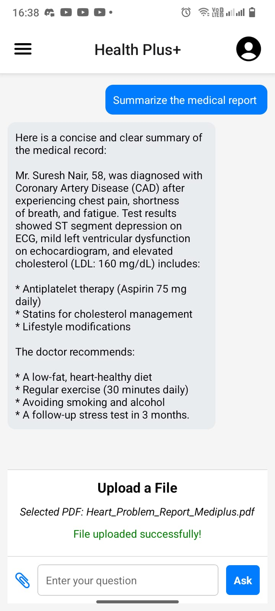

# 🩺 Health Plus+ – Smart Healthcare Companion

*Health Plus+* is an intelligent healthcare assistant that combines AI-driven features with a user-friendly mobile interface to simplify medical access, doctor discovery, report interpretation, and appointment booking. This app bridges the gap between patients and personalized medical care with modern technology.

---

## 📱 Features

### 🏠 Home Screen & Navigation
- Personalized greeting and *doctor search bar*.
- Sections to explore *Popular Doctors* and *Featured Doctors*.
- Integrated *SOS emergency button*.
- Easy navigation through the *bottom navigation bar* and *side drawer* menu.

<h4>🖼️ Screenshot: Home Page</h4>

---

### 📂 Drawer Navigation Menu
- *Home* – Return to the main dashboard.
- *AiMedical* – Access the AI medical assistant.
- *MyDoctors* – View and manage saved doctors.
- *MyAppointment* – Manage upcoming and past appointments.
- *MedicalRecords* – Upload and view diagnostic files.
- *MedicalOrders* – Track medicine or lab test orders.
- *Stores* – Explore online medical shops.
- *Favorites* – Quick access to frequently used features.
- *Profile* – Manage personal information and preferences.

<h4>🖼️ Screenshot: Navigation Menu</h4>

---

## 🤖 AI Medical Assistant

### 💬 Symptom Checker & Appointment Booking
- Conversational AI that:
  - Understands *user symptoms or queries*.
  - Determines the *right specialist* for the problem.
  - Considers *user location* to suggest nearby doctors.
  - *Books appointments* automatically, saving time and effort.

📽️ <strong>Demo: AI Health Query and Appointment Booking</strong>  
<a href="./assets/aiagent.mp4">▶ Watch Video</a>

---

### 📑 Medical Report Summarizer
- Users can upload *PDF medical reports*.
- The AI:
  - Extracts and summarizes *key medical information* from the report (text, tables, images).
  - Highlights:
    - Diagnosis
    - Clinical test results
    - Treatment plans and medications
    - Doctor's recommendations and next steps
- Makes complex reports *easy to understand* for any user.

<h4>🖼️ Screenshot: Report Summary</h4>

---

## ✅ Key Benefits
- Saves time with instant AI-based appointment booking.
- Empowers users with clearer understanding of their health.
- Makes healthcare *more accessible, fast, and smart*.
- Designed with a clean, intuitive UI and *mobile-first approach*.

---

## 📸 Screenshots Overview

  
  
  

---

## 📽 Full Demo Video

🎬 AI Agent solving user queries and booking appointments:  
<a href="./assets/aiagent.mp4"><strong>▶ Click to Play</strong></a>

---
